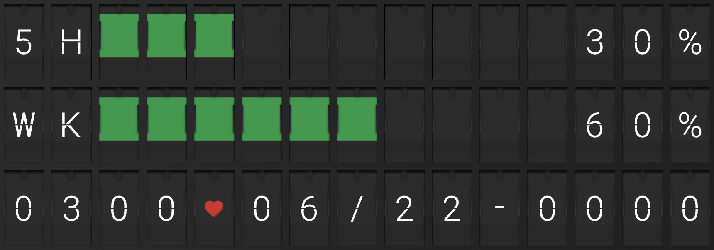
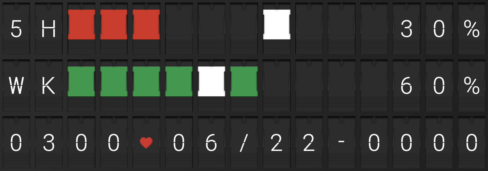
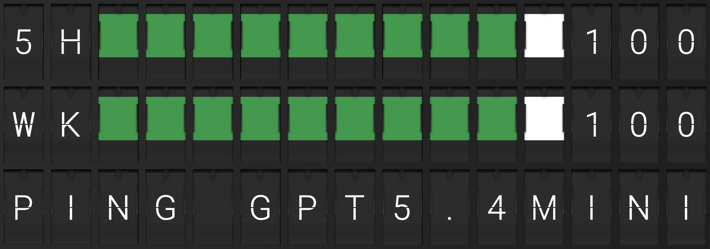
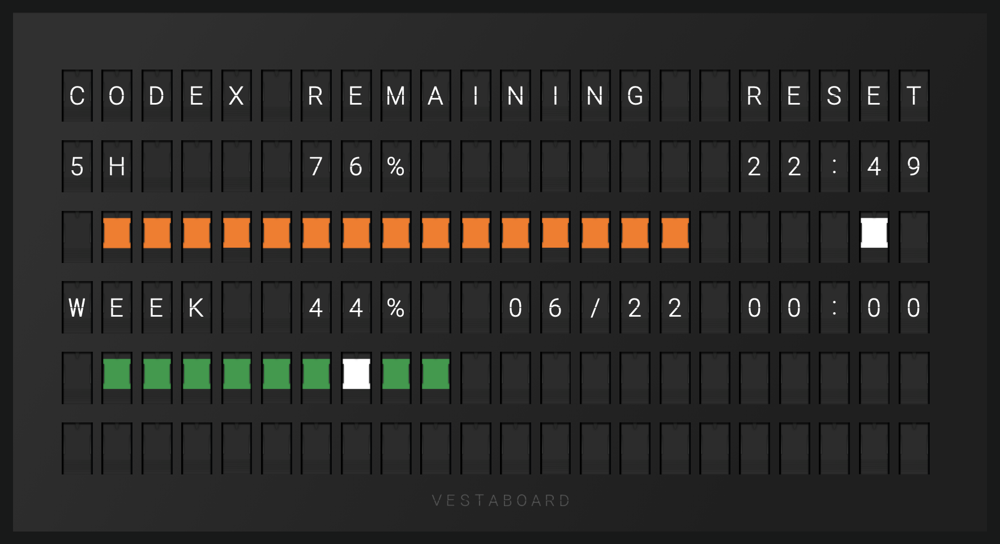

# [Vestaboard](https://web.vestaboard.com/referral?vbref=NZJHOT) Orchestrator

A small TypeScript service for [Vestaboard](https://web.vestaboard.com/referral?vbref=NZJHOT), a connected split-flap-style display for showing short messages, status, and ambient information, that polls local plugins, picks the highest-priority message, and sends it to the board (referral link).



## How to Set Up

Docker is the intended runtime path.

1. Copy the example environment file:

   ```sh
   cp .env.example .env
   ```

2. Set `VESTABOARD_TOKEN` in `.env` to a Vestaboard Cloud Read/Write API token.

3. Make sure Docker can see your Codex auth. By default, Compose mounts `${HOME}/.codex` into `/home/node/.codex`, which lets `codex app-server` reuse persisted auth. If your Codex config lives somewhere else, set `CODEX_HOST_DIR` in `.env`.

4. Start the orchestrator:

   ```sh
   docker compose up --build
   ```

Core environment variables configure the orchestrator and Vestaboard transport. Plugin-specific variables are documented in each plugin section below.

| Variable | Default | Description |
| --- | --- | --- |
| `ORCHESTRATOR_INTERVAL_MINUTES` | `5` | How often the orchestrator polls plugins. |
| `VESTABOARD_TOKEN` | **You MUST set either this or VESTABOARD_LOCAL_API_KEY** | Vestaboard Cloud Read/Write API token. |
| `VESTABOARD_CLOUD_URL` | `https://cloud.vestaboard.com/` | Vestaboard Cloud API endpoint. |
| `VESTABOARD_LOCAL_API_KEY` | **You MUST set either this or VESTABOARD_TOKEN** | Local API key. If set, this is preferred over the cloud API. |
| `VESTABOARD_LOCAL_URL` | `http://vestaboard.local:7000/local-api/message` | Local API endpoint. |
| `VESTABOARD_BOARD` | `auto` | Board renderer: `auto`, `note`, or `flagship`. In `auto`, the orchestrator reads the current message layout through the configured Vestaboard API and detects Note (`3x15`) or Flagship (`6x22`). If detection cannot determine the board type, it assumes Note for that tick and retries on the next tick. |

The loop is serial: it runs one plugin pass, sends the selected message, waits `ORCHESTRATOR_INTERVAL_MINUTES`, then starts the next pass. If the winning message is unchanged from the last successful send, the orchestrator skips the Vestaboard API call.

## Plugins

### Codex

The Codex plugin reads `account/rateLimits/read` from `codex app-server` and renders the 5-hour and weekly quota windows for Vestaboard Note and Flagship.

| Configuration | Screenshot | What it means |
| --- | --- | --- |
| Pacing on |  | Colored blocks are quota remaining. <br>Green means quota is at or ahead of the time-remaining pace. Yellow, orange, and red mean progressively worse pacing deficits. <br>White is the current time marker and always overrides the quota color. |
| Pacing off |  | `CODEX_QUOTA_SHOW_PACING=off` hides pacing entirely: only green quota blocks and blanks remain. This is the clean, quiet mode for just checking remaining quota. |
| Auto-start ping |  | Only if enabled: when a watched window is still full at 100%, the plugin can send one minimal Codex ping to start a real reset window. The status lane briefly shows the ping model. |
| Flagship |  | This plugin supports Flagship boards' 6x22 layout as well -- with 20-cell centered bars, right-aligned reset labels, and a final-row status lane. |

The first two rows are quota windows:

```text
5HRRR   W   30%
WKGGGGWG    60%
0300♥06/22-0000
```

`G`, `Y`, `O`, `R`, and `W` in dry-run output stand for Vestaboard green, yellow, orange, red, and white block character codes. The actual API payload sends `characters`, not plain text. Percentages are remaining quota, derived from `100 - usedPercent`. Full quota renders as `100` on Note so the row still fits, and as `100%` on Flagship where the larger usage field has room.

On Note, the status lane is the third physical row. It normally shows reset timing: 5-hour reset time, weekly reset date, and weekly reset time. Current-cycle statuses, fetch failures, missing quota windows, reset availability, and auto-start ping notices temporarily replace reset timing; expired statuses are pruned on later ticks.

On Vestaboard Flagship, the same quota data renders as a 6-row by 22-column layout. Reset timing moves into the 5-hour and weekly rows, the progress bars expand to 20 centered cells, and the final row stays blank unless the shared status lane has an active status such as `RESET AVAILABLE`, `AUTO PING FAIL`, `MISS WK`, `TIMEOUT`, or `FETCH FAIL`.

If Codex is temporarily unavailable after a successful read, the plugin can reuse cached quota ingredients and mark the board with a short status-lane message instead of throwing away the display.

#### Codex Login

The app-server quota source needs a Codex login in the directory Docker mounts into the container.

There are two common cases:

- If you run this on the same machine where you normally use Codex, Compose already mounts `${HOME}/.codex` into the container. No extra login step is needed.
- If you run this on a server with Docker, go to the directory that contains `docker-compose.yml` and log in using the Codex binary inside the container:

  ```sh
  docker compose run --rm --build vestaboard-orchestrator codex login --device-auth
  ```

If the host login directory is somewhere else, set `CODEX_HOST_DIR` in `.env` to that host path. Compose mounts it at `/home/node/.codex` inside the container, where `codex app-server` reads the persisted auth and config.

#### Codex Env Config

| Variable | Default | Description |
| --- | --- | --- |
| `CODEX_QUOTA_SOURCE` | `app-server` | Use `fixture` for offline formatting checks. |
| `CODEX_QUOTA_PRIORITY` | `normal` | Plugin priority: `low`, `normal`, `high`, `urgent`, or a number. |
| `CODEX_QUOTA_ERROR_PRIORITY` | `low` | Priority used when the plugin can only render an error or incomplete quota. |
| `CODEX_QUOTA_TIME_ZONE` | local process timezone | Time zone used for reset labels. |
| `CODEX_QUOTA_SHOW_PACING` | `on` | `on` overlays red/blue pacing blocks; `off` shows only green quota blocks and blanks. |
| `CODEX_HOST_DIR` | `${HOME}/.codex` | Host Codex config directory mounted into Docker at `/home/node/.codex`. |
| `CODEX_AUTO_START_WINDOW_5H` | `false` | Ping Codex once when the 5-hour window is completely unused at 100%. |
| `CODEX_AUTO_START_WINDOW_WK` | `false` | Ping Codex once when the weekly window is completely unused at 100%. |
| `CODEX_QUOTA_DEMO_PAUSE_MINUTES` | `5` | How long normal polling pauses after a signal-triggered demo render. |

When auto-start is enabled, the plugin lists visible Codex models, skips `-spark` models, prefers the last `-nano` model, then the last `-mini` model, then the last remaining model. It sends a read-only ephemeral prompt: `Reply exactly: ok. Do not inspect files or run commands.` A running process auto-starts at most once per reset timestamp and never pings more than once every 30 minutes unless forced by demo mode.

When the weekly quota row is exhausted at 0% and `account/rateLimits/read` reports reset credits are available, the status lane shows `RESET AVAILABLE`. The plugin only displays that read-only account status; it does not invoke a reset.

#### Demo Mode

Use fixture mode to validate formatting without an authenticated Codex app-server:

```sh
CODEX_QUOTA_SOURCE=fixture docker compose up --build
```

The long-running process can render one realistic Codex quota demo without restarting:

```sh
kill -HUP <pid>   # drop one percentage point from 5H remaining quota
kill -USR2 <pid>  # force a Codex ping and show the retained status-lane ping message
```

Signals are cumulative for the running process. Two `SIGHUP`s render a two-point drop, and later demo signals continue from the accumulated demo offset. `SIGUSR2` bypasses auto-start env flags, the 30-minute ping cooldown, and the unused-window check so the ping path can be tested on demand.
